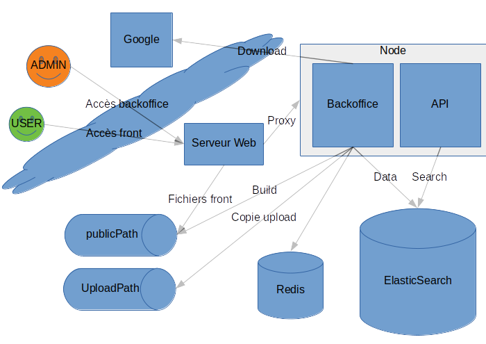
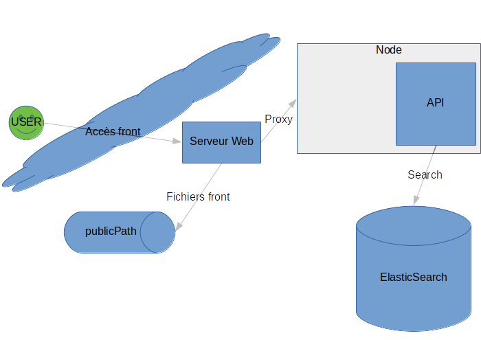

# e-Atlas ‑ documentation technique

## Architecture technique

### Architecture réseau

Les éléments de l'application s'agencent ainsi sur le réseau :

- C'est le serveur web qui est l'interface principale, il doit servir le _front_ et le _back_
- Le _front_ est composée des fichiers de `publicPath` (générés par le _back_ lors du _build_) et de l'API de recherche (URL `/search` du serveur Node)
- Le _back_ est composé de l'ensemble

Pour un utilisateur final du site _front_, seuls les éléments suivants sont concernés :

### Serveur web Proxy

On peut dénombrer 3 "lots" d'URLs servies par le serveur web :

- Le backoffice (localement `http://node/*`, extérieur `http://backoffice`, accessible seulement aux admins)
- L'API de recherche (localement `http://node/search` extérieur `http://public/api/search` par exemple, accessible publiquement)
- Le site _front_ (localement `publicPath` extérieur `http://public`)
  - À noter : la 404 pour ce site est `publicPath/not-found.html` par défaut

### Choix de conception : stockage des données

Afin de ne pas avoir à mettre en place une indexation et un stockage séparés, nous avons décidé de stocker l'ensemble dans Elastic Search. Ce choix implique la prudence car il a été expérimenté (douloureusement) que l'aspect non _schemaless_ d'Elastic Search impose des manipulation d'index lors des modification de la structure de données qui peuvent mener à la perte de données : [Les sauvegardes sont importantes](./Backup.md#sauvegarde) et il est conseillé de désactiver la migration automatique (cf. [option `es.autoMigration`](./Configuration.md#configuration)) après le premier démarrage.

Les [données](./Data.md#structure-des-données) sont distribuées sur 3 indices :

- `eatlas_user` (cf. [option `es.indices.user`](./Configuration.md#configuration))
- `eatlas_resource` (cf. [option `es.indices.resource`](./Configuration.md#configuration))
- `eatlas_topic` (cf. [option `es.indices.topic`](./Configuration.md#configuration))

#### Mapping, alias, et migration automatique

Le _mapping_ est décrit dans les fichiers JSON du dossier `server/lib/es/types` (un par indice).

Afin de simplifier les opérations de maintenant sur les indices, on utilise [les alias Elastic Search](https://www.elastic.co/guide/en/elasticsearch/reference/current/indices-aliases.html), par exemple :

- `eatlas_resource` est un alias, c'est celui qui sera interrogé par les requêtes du serveur Node
- On aura à côté des indices réels, suffixés par un timestamp :
  - `eatlas_resource_1533201955550` (2 août 2018)
  - `eatlas_resource_1532600450668` (26 juillet 2018)
- Dans la situation normal, l'alias pointe vers l'indice le plus récent
- Ces informations peuvent être obtenues sur http://localhost:9200/_cat/aliases si l'accès à ELastic Search est possible, ou sinon par la commande `yarn es-index` si l'accès à la ligne de commande est possible.

Les indices doivent être migrés lorsque le _mapping_ est détecté comme obsolète, c'est à dire lorsque les informations stockées dans Elastic Search (cf. http://localhost:9200/_mapping) diffèrent de ce qui est décrit dans `server/lib/es/types`. Cela peut être fait :

- automatiquement au démarrage du serveur (ou lors du lancement des commandes utilitaires) si `es.autoMigration` est activé.
- manuellement via la commande `yarn es-index reindex <resource|topic|user>`

Cette opération consiste à :

- Créer un nouvel indice vide `<alias>_<timestamp>`
- Lui appliquer le mapping stocké dans `server/lib/es/types/<alias>.json`
- [Réindexer les données](https://www.elastic.co/guide/en/elasticsearch/reference/current/docs-reindex.html) de `<alias>` vers `<alias>_<timestamp>`
- Modifier l'alias pour qu'il pointe vers le nouvel indice

#### Amélioration ?

Il serait possible de séparer le stockage des données sur deux serveurs :

- Une base de données nosql pour le stockage des utilisateurs, des topics et des ressources (les ressources étant des documents complexes, une base type MongoDB serait le choix le plus simple)
- Un cluster Elastic Search uniquement pour la recherche, ne contenant que les données full-text + id

### Architecture logicielle

Le projet est séparé en deux grandes couches `client` et `serveur`, en réalité il y a 3 parties :

- Le serveur : dossier `server`
- Le backoffice : dossier `client`
- Le front : dossier `client/src/components/preview`
  - Ce choix a été fait initialement car on comptait faire générer la preview côté client par le backoffice
  - Au final, le nombre important de requêtes pour accéder aux données rendant la tâche compliquée, ces composants ne sont utilisées que par le serveur

#### Fichier `serveur`

Il s'agit d'une application Express, prévue pour tourner sous Node ≥ 8.0 (support ES6).

#### Fichiers `client`

Il s'agit d'une application React classique, sans spécificité particulière. Elle est construite à l'aide de `react-scripts` (`create-react-app`), et les composants dans `src/components` peuvent donc utiliser les modules ES6, le JSX, et les syntaxes ES7 comme l'object spreading. Attention à l'exception `preview` !

#### Fichiers _front_

Les fichiers du dossier `client/src/components/preview` sont un peu particuliers, car il s'agit des composants utilisés pour générer le front, et ils sont en réalité exécutés… par le serveur (choix expliqué plus haut).

- Il s'agit de composants React standard, prenant quasiment tous au moins les _props_ suivantes :
  - `options` : objet contenant les options "front" :
    - `preview` : booléen indiquant si on fait un rendu "preview" ou "prod", principalement pour la génération des URLs
    - `apiUrl` : l'URL du serveur pour les appels à l'API de recherche
    - `analytics` : le code Google Analytics
  - `topics` et `articles` : liste de ressources communes à toutes les pages contenant le menu (donc toutes les pages)
- Attention car ces composants **ne sont pas transpilés**, et sont exécutés directement par le serveur, ce qui signifie :
  - Pas de JSX
  - Pas d'object-spreading
  - Modules CommonJS (`require` et pas `import`)
  - Pas de DOM (`window`, `document`…)
  - Les modules importés doivent être compatible Node

À l'origine on souhaitait que ces composant ne dépendent pas du serveur, et on a donc évité au maximum l'utilisation de modules serveur, ce qui a mené à des circonvolutions parfois un peu complexes (et regrettées) au niveau de l'API.

Liste des fichiers concernés :

- Tout le dossier `client/src/components/preview`
- Les bibliothèques "communes" (chargée par le front et le serveur)
  - `client/src/universal-utils.js` : on y trouvera pêle-mêle de la configuration ([car le front ne peut accéder directement à la config serveur](./Configuration.md#configuration)) et des APIs de parcours des données
  - `client/src/components/preview/layout.js` : contient de la logique purement front jusqu'à récemment où le serveur la charge pour sa fonction `globalePageUrl` (il pourrait être intéressant à terme de supprimer ce module pour le fusionner avec `universal-utils`)
